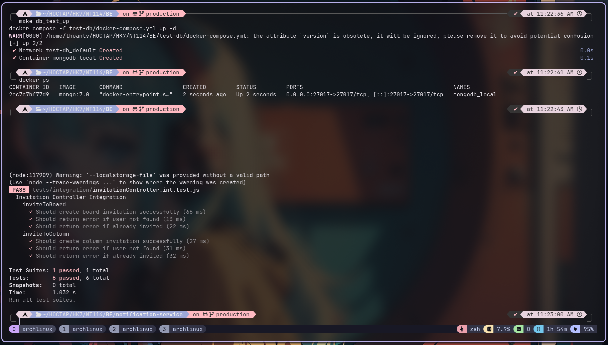
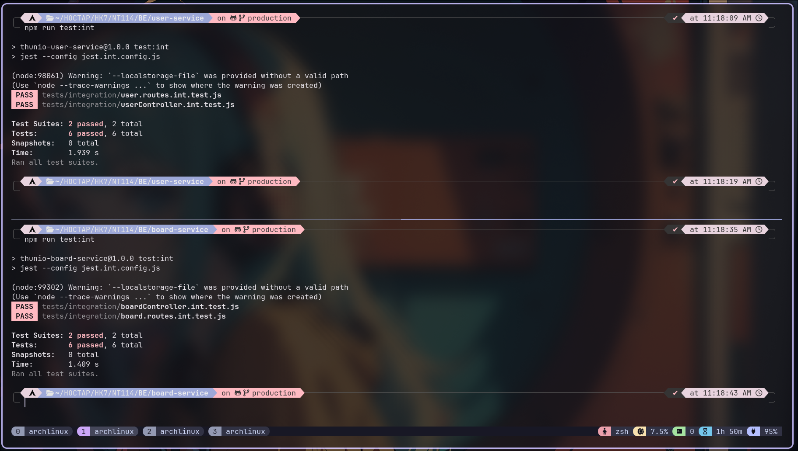
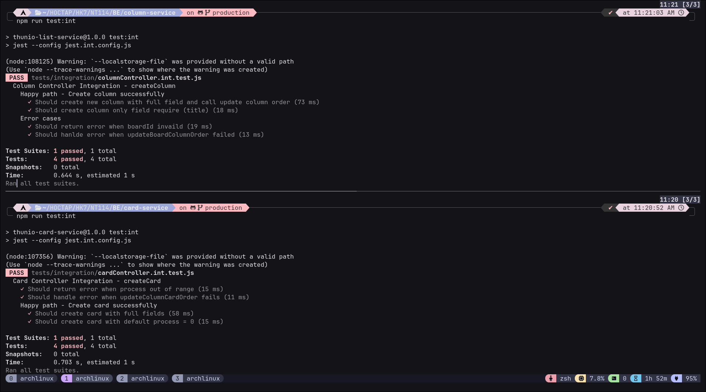
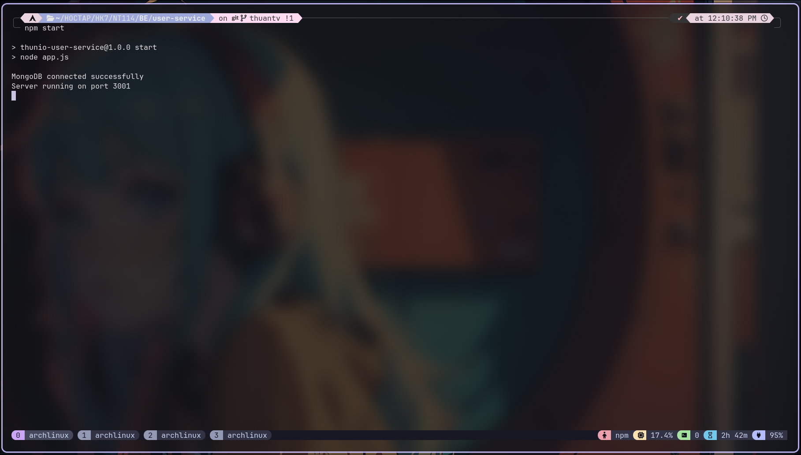
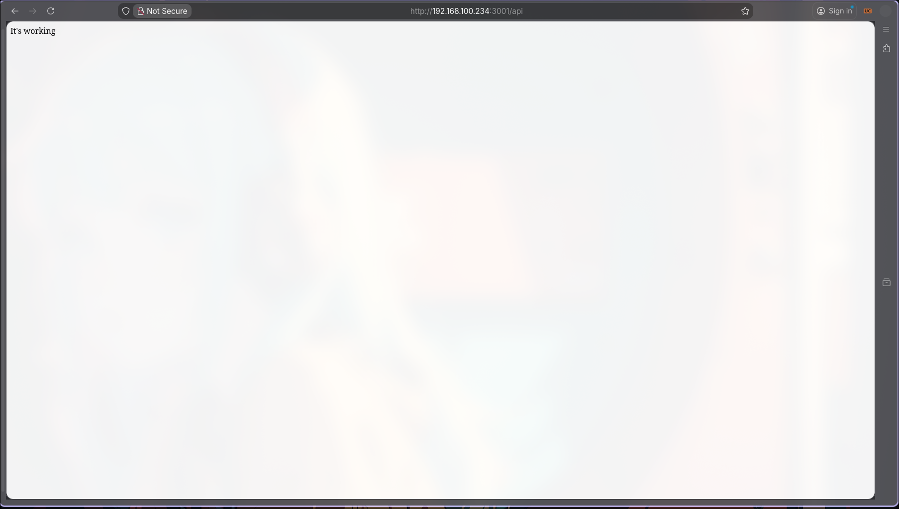
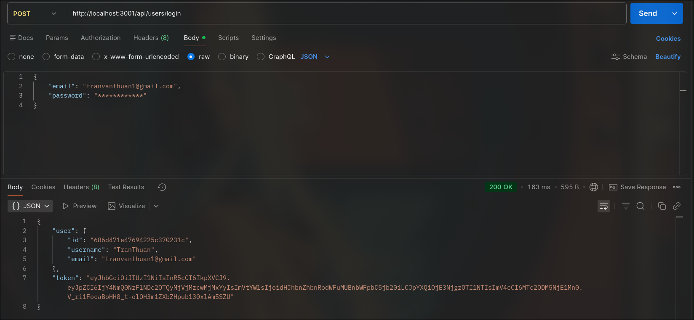
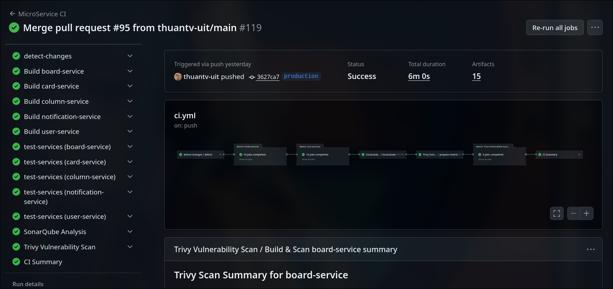
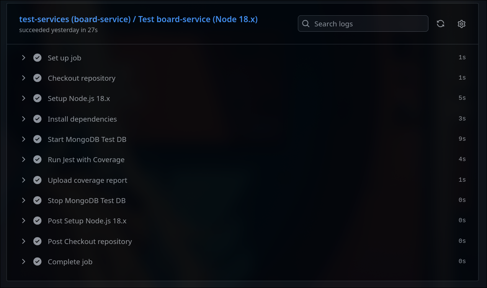
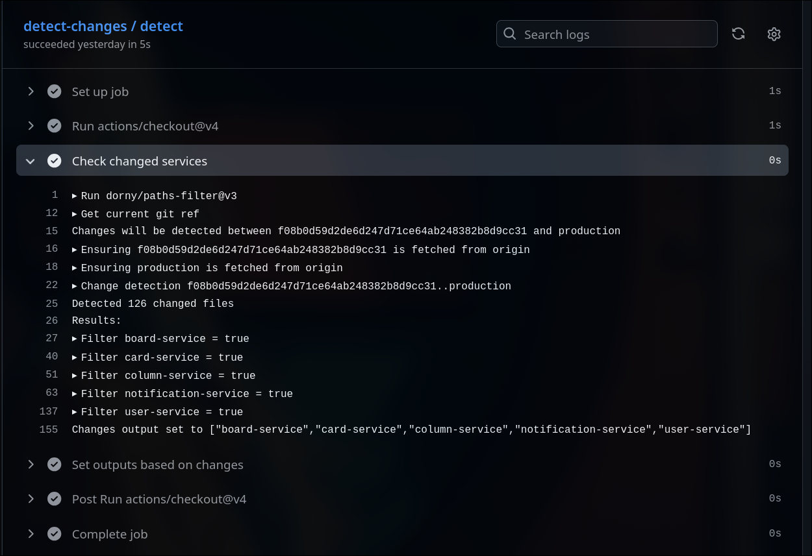
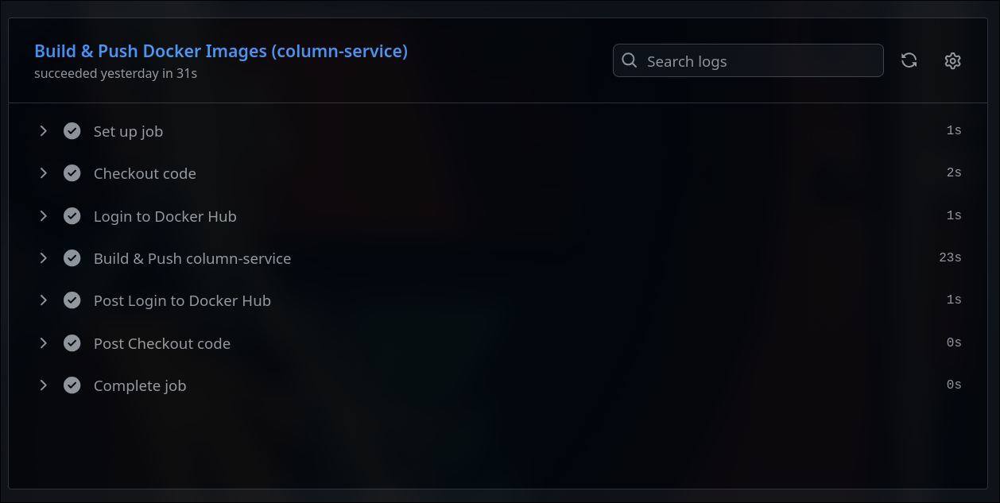

# Thunio Backend – Microservices Architecture

---

## 📌 Overview
The Thunio Backend is a microservices-based backend system designed to support the Thunio team collaboration application.

It provides scalable, independent services responsible for user management, board organization, task handling, and collaboration features.

Each service is implemented using Node.js and communicates through RESTful APIs, following real-world microservices principles.

---

## 📸 Backend Demo
### 🧪 Unit Testing Demo (Jest)
#### 🗄️ Test Database Setup
<p align="center">  </p>

#### 👤 User & 📋 Board Service Tests
<p align="center">  </p>

#### 🧱 Column & 📝 Card Service Tests
<p align="center">  </p>

### ▶️ Server Execution Demo
<p align="center">   </p> 

### 🔁 CI/CD Demo
#### 🔍 Continuous Integration (CI)
**1. 🧭 CI Workflow Overview**
<p align="center">  </p>

**2. 🧪 CI Detail – Testing & Detect Changes**
<p align="center">  </p> <p align="center">  </p>

#### 🚀 Continuous Deployment (CD)
**1. 🧭 CD Workflow Overview**
<p align="center">  </p>

**2. 🐳 CD Detail – Build & Push Docker Images**
<p align="center">  </p>

---

## 🧱 Architecture Overview
The backend is composed of independent microservices, each responsible for a specific domain.
Every service runs on its own port and can be developed, tested, and deployed independently.
### 🔧 Microservices List

| Service            | Description                                           | Port |
|--------------------|-------------------------------------------------------|------|
| User Service       | User authentication, registration, profile management | 3001 |
| Board Service      | Board creation and management                         | 3002 |
| Column Service     | Column (list) management within boards                | 3003 |
| Card Service       | Card (task) management                                | 3004 |
| Invitation Service | Board invitation & collaboration handling             | 3005 |

---

## 🚀 Core Features
### 👤 User Management
- User registration and login
- Authentication handling
- Profile updates

### 📋 Board Management
- Create, update, delete boards
- Organize collaboration spaces

### 🧱 Column Managemen
- Create and manage columns within boards
- Maintain board structure

### 📝 Card Management
- Create, update, delete task cards
- Handle task-level information

### 👥 Invitation System
- Invite users to boards
- Accept or decline invitations
- Enable collaborative workflows

---

## 🛠️ Tech Stack
### Backend
- **Runtime**: Node.js  
- **Framework**: Express.js  
- **Database**: MongoDB  
- **Architecture**: Microservices
- **API Styles**: RESTful APIs

### CI/CD
- **GitHub Actions**
- **Jest** – Unit testing
- **SonarQube** – Code quality & maintainability
- **Trivy** – Vulnerability scanning
- **Docker** – Containerization
- **Docker Hub** – Image registry

---

## 📁 Project Structure
```
NT114_MicroServices_BE/
├── user-service/              # User & authentication service
├── board-service/             # Board management service
├── column-service/            # Column management service
├── card-service/              # Card management service
├── invitation-service/        # Invitation & collaboration service
├── package.json
└── README.md
```
Each service follows a clean structure:
- Controllers
- Routes
- Services
- Models
- Configuration files

---

## 🔄 Git Workflow & CI/CD
### 🌿 Branching Strategy
- `feature/*` – Feature development
- `main` – Integration branch
- `production` – Stable deployment branch

### 🔁 Development Flow
1. Develop features in `feature/*`
2. Create Pull Request into `main`
3. CI pipeline runs automatically:
    - Detect relevant changes
    - Build affected services only
    - Run Unit Tests (Jest)
    - Code quality analysis (SonarQube)
    - Security scan (Trivy)
    - Pipeline summary
4. Merge allowed only if CI passes
5. Merge `main` → `production`
6. CD pipeline builds and pushes Docker images

### ⚙️ Continuous Integration (CI)
The CI pipeline is automatically triggered when a Pull Request targets the `main` branch.

CI stages:

**1. Detect Changes**
- Identify whether modified files impact backend services
- Skip unnecessary steps if no relevant changes are detected

**2. Install Dependencies**
- Install dependencies for affected microservices only

**3. Build Services**
- Build only services impacted by the changes

**4. Run Unit Tests (Jest)**
- Execute Jest unit tests for each affected service
- Ensure business logic correctness before merging

**5. Code Quality Analysis (SonarQube)**
- Static analysis for bugs, code smells, and maintainability
- Enforce quality gates

**6. Security Scan (Trivy)**
- Scan dependencies and build artifacts for vulnerabilities

**7. CI Summary**
- Aggregate results from all CI stages
- Provide a clear pass/fail status for reviewers

**⛔ Merging into `main` is blocked unless all CI steps pass successfully.**

### 🚀 Continuous Deployment (CD)
Triggered automatically when code is merged into the production branch.

CD stages:

**1.** Build Docker images for backend services 
**2.** Tag images using version or commit hash
**3.** Push images to Docker Hub

The `production` branch always represents a deployable and stable backend state.

### 📌 CI/CD Flow Summary
```
feature/*
   ↓ Pull Request
  main
   ↓ CI (Detect → Build → Jest → SonarQube → Trivy → Summary)
  production
   ↓ CD (Build Image → Push to Docker Hub)
```

---

## ⚙️ Installation & Setup
### 1. Clone the Repository

```bash
git clone https://github.com/thuan410/NT114_MicroServices_BE.git
cd NT114_MicroServices_BE
```

### 2. Install Dependencies for Each Service
```bash
npm install
```

### 3. Configure Environment Variables

```bash
PORT=<port_number>  # 3001 for user, 3002 for board, etc.
MONGODB_URI=<your_mongodb_connection_string>
```

### 4. Start MongoDB
```bash
mongod
```

### 5. Run Each Service
```bash
cd user-service && npm start
cd board-service && npm start
cd column-service && npm start
cd card-service && npm start
cd notification-service && npm start
```

---

## 🔗 Service Endpoints
| Service Name        | Port | Base URL                  | Description |
|---------------------|------|---------------------------|-------------|
| User Service        | 3001 | http://localhost:3001     | User authentication & management |
| Board Service       | 3002 | http://localhost:3002     | Board management |
| Column Service      | 3003 | http://localhost:3003     | Column management |
| Card Service        | 3004 | http://localhost:3004     | Card management |
| Invitation Service  | 3005 | http://localhost:3005     | Board invitations |

---

## 🌟 Future Improvements
- API Gateway integration
- Service-to-service authentication
- Centralized logging & monitoring
- Message broker (Kafka / RabbitMQ)
- Rate limiting and circuit breakers

---

## 👤 Author
- **Project**: Thunio Backend
- **Author**: Tran Van Thuan
- **Email**: thuantranuit2004@gmail.com
- **GitHub**: https://github.com/thuantv-uit
- **Linkedin**: https://www.linkedin.com/in/thuan-tran-van-6a41a333b/

---

## 📄 License
MIT License
